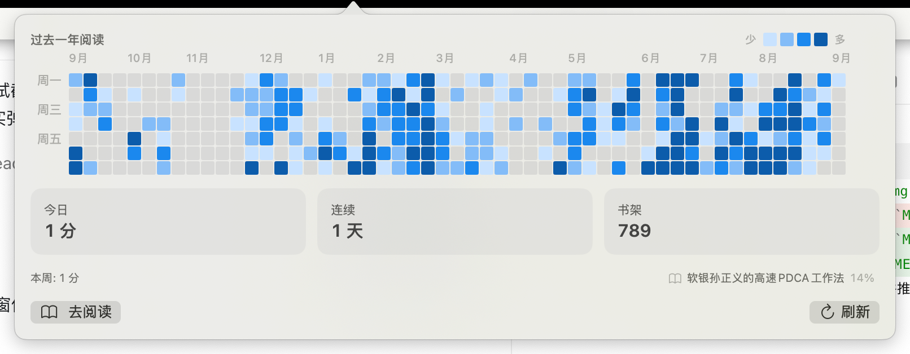

<div align="center">

# WeReadBar

**一个轻量的 macOS 菜单栏应用，把微信读书（WeRead）的阅读数据一眼呈现。**

[📥 **下载**](../../releases/latest) · [⭐ Star](../../stargazers) · [🐛 反馈问题](../../issues)

</div>

---

## 这是什么？

WeReadBar 住在你的菜单栏里，展示：

- **全年热力图** —— GitHub 风格的贡献图，不过记录的是阅读
- **今日时长**、**连续阅读**、**书架总数** —— 三个关键数字一眼看完
- **本周合计** —— 当前周一至周日的累计阅读时长
- **当前在读** —— 显示书名与阅读进度，点击可前往网页版继续阅读



---

## 功能

- 📊 **全年热力图** —— 最近 53 周、共 371 天的阅读时长，按强度上色
- 🔥 **连续阅读** —— 已连续多少天每天阅读（每天 ≥ 1 分钟）
- 📚 **书架总数** —— 书架上的书 + 专辑 + 公众号
- ⏱ **今日分钟** —— 今天到现在读了多少分钟
- 📅 **本周合计** —— 当前周一至周日累计
- 📖 **当前在读** —— 显示最近阅读书籍的进度，点击直达微信读书网页版
- 🌍 **三语支持** — English / 简体中文 / 繁體中文（跟随系统语言）
- 🔐 **本地保存** —— API 令牌仅保存在本机的应用偏好设置中
- 🚫 **纯菜单栏体验** —— 没有 Dock 图标；左键查看数据，右键可刷新或更换令牌

---

## 安装

需要 **macOS 14 (Sonoma)** 或更新版本，以及一个微信读书账号。

1. **[下载最新 DMG](../../releases/latest)**
2. 打开 DMG，把 **WeReadBar** 拖到 **/Applications**
3. **首次启动 — macOS Gatekeeper 拦截**（只第一次）：
   - 打开 **系统设置 → 隐私与安全性**
   - 滚到最下面，看到「WeReadBar 已被阻止打开，因为无法验证其为开发者所写」
   - 点右边的 **「仍要打开」**，再确认一次
   - 之后双击 / 右键就直接打开，再也不问
4. 提示时粘贴 **WeRead API bearer token**（在 [weread.qq.com/r/weread-skills](https://weread.qq.com/r/weread-skills) 获取）
5. 点菜单栏的书本图标 🎉

> **为什么有这一步？** 任何不在 Mac App Store 里、也不走 macOS 官方认证流程分发的 app，macOS 第一次启动时都会拦一下让你确认。点「仍要打开」是 macOS 给非商店 app 留的标准通道。一次之后 macOS 就记住你了。

---

## 隐私

- **网络**：WeReadBar 只跟 `i.weread.qq.com`（微信读书官方 API 网关）通信。无埋点、无遥测、无第三方服务。
- **凭据**：API 令牌保存在 macOS 的应用偏好设置中（键名 `WeReadBar.apiToken`），仅供本应用使用。
- **磁盘缓存**：没有。每次刷新都重新从微信读书拉。
- **源码**：完全开源。随便读、审、fork。

---

## 常见问题

<details>
<summary><b>为什么需要 API 令牌？</b></summary>

WeReadBar 通过微信读书数据网关读取数据，使用与官方 [微信读书 Claude Skill](https://github.com/Tencent/WeChatReading) 相同的 API。提供 bearer token（格式 `wrk-xxxxxxxx`）后，应用才能读取书架、阅读时长和当前在读；没有令牌就无法拉取这些数据。

在 [weread.qq.com/r/weread-skills](https://weread.qq.com/r/weread-skills) 获取。
</details>

<details>
<summary><b>会费电或拖慢 Mac 吗？</b></summary>

应用只驻留在菜单栏，并仅在弹窗打开期间每 30 分钟轮询一次；关闭弹窗后会停止该轮询。实际资源占用会因设备和网络状态而异。
</details>

<details>
<summary><b>能干净卸载吗？</b></summary>

能。把 `/Applications` 里的 `WeReadBar.app` 拖到废纸篓。要清掉存的令牌：
```bash
defaults delete com.local.wereadbar WeReadBar.apiToken
```
</details>

<details>
<summary><b>热力图数据怎么来的？</b></summary>

优先使用年度接口返回的每日阅读数据；当该字段缺失时，WeReadBar 会连续请求约 13 个月的月度数据并拼接为全年视图。加载期间会显示骨架热力图，完成后再展示真实数据。
</details>

---

## 请我喝杯咖啡 ☕

如果 WeReadBar 帮到你了，欢迎请我喝杯咖啡：

| 支付宝 | 微信支付 |
|:---:|:---:|
|  |  |

---

## 致谢

- **数据源**：[微信读书 (WeRead)](https://weread.qq.com/) —— 腾讯的读书 app
- **API 网关**：[Tencent/WeChatReading](https://github.com/Tencent/WeChatReading) —— 官方 Claude Skill，本 app 构建于其上
- **技术栈**：Swift + SwiftUI，原生 AppKit 菜单栏集成
- **License**：MIT

---

<div align="center">

觉得有用的话，给个 ⭐ 帮别人发现它。

</div>
